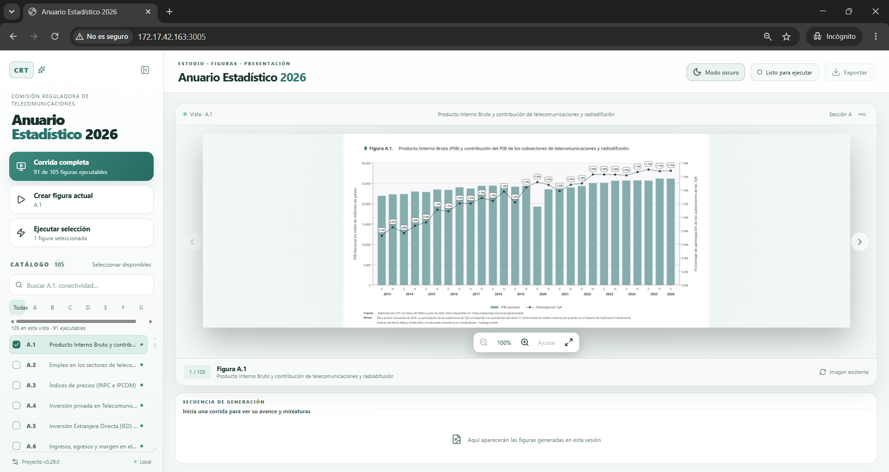
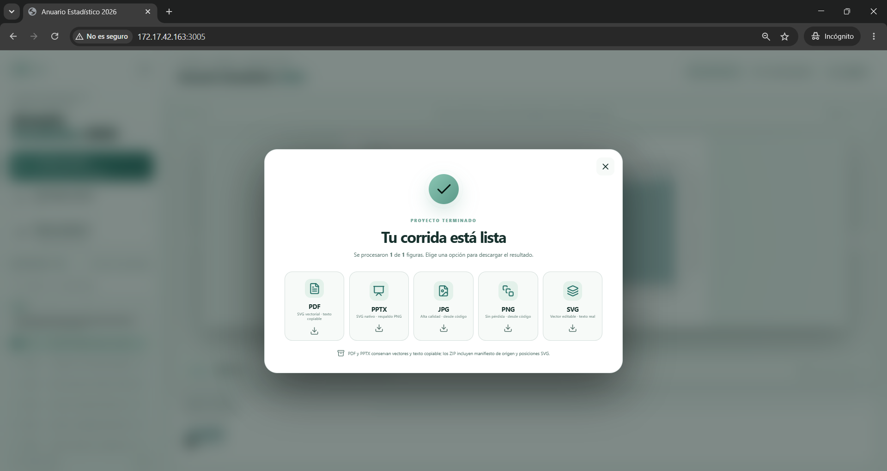

# Anuario Estadístico 2026

Aplicación local para **actualizar y generar las figuras del Anuario Estadístico
2026** a partir de datos verificables. El proyecto reúne la descarga o
reutilización de fuentes, el cálculo de indicadores, la creación de gráficas y el
registro de la evidencia de cada corrida. La interfaz web permite consultar el
catálogo, ejecutar figuras y descargar los resultados sin trabajar directamente
con los scripts.

La edición integral reúne **131 páginas**, las **91 figuras automatizadas de A a G**,
las **14 figuras históricas de H** y **44 campos editoriales completos**. Las
figuras de H conservan el corte de julio de 2023 a junio de 2024 porque todavía
no se dispone de las bases licenciadas de Nielsen IBOPE / MSS TV e INRA / INRAM.
Es un borrador reproducible para revisión académica e institucional; cada
indicador muestra su propio periodo observado.

## La interfaz web

La web se ejecuta en la computadora del usuario y se abre en
http://172.17.42.163:3005/. Desde ella se puede:

- Buscar figuras en el catálogo y filtrar por sección.
- Ver una figura en grande, navegar entre resultados y ampliar la imagen.
- Crear la figura actual, ejecutar una selección o iniciar una corrida completa.
- Seguir el avance de la generación en tiempo real.
- Descargar la corrida en PDF, PPTX o compendios de imágenes JPG, PNG y SVG.
- Cambiar entre modo claro y oscuro.

### Vista principal

El panel izquierdo reúne el catálogo y las acciones de ejecución; el área central
muestra la figura seleccionada y el avance de la corrida.



### Descarga de resultados

Al terminar una corrida, la interfaz presenta las opciones de exportación. La
captura muestra una corrida de una figura; el mensaje de finalización se refiere
a esa corrida, no a todas las secciones del proyecto.



## Inicio rápido

Se requiere **Python 3.11 o superior**. La interfaz web también necesita
**Node.js 20 o superior**. Para exportar a PDF se requiere **Microsoft PowerPoint
o LibreOffice**.

En Windows, desde la raíz del repositorio:

```powershell
# Preparar el entorno y compilar la interfaz (sólo la primera vez)
.\preparar_entorno.ps1

# Revisar que el proyecto esté listo
.\ejecutar.ps1 doctor

# Abrir la interfaz web
.\ejecutar.ps1 web
```

Si se modifica el código de la interfaz, se recompila desde `web/` con
`npm run build`. La [guía del frontend](web/README.md) incluye el modo de desarrollo.

### Ejecución desde la terminal

La interfaz no es necesaria para ejecutar las figuras:

```powershell
# Generar todas las figuras disponibles y ensamblar el PowerPoint
.\ejecutar.ps1 run --assemble

# Generar una sola figura
.\ejecutar.ps1 run --only G.1

# Generar un tramo del catálogo
.\ejecutar.ps1 run --from A.1 --until G.1
```

En macOS o Linux se usan `./preparar_entorno.sh` y `./ejecutar.sh` con los mismos
subcomandos (`doctor`, `web` y `run`).

## Resultados y trazabilidad

| Resultado                                                 | Ubicación                                             |
| --------------------------------------------------------- | ------------------------------------------------------ |
| Figuras PNG, JPG y SVG                                    | `build/figures/<sección>/`                          |
| Textos generados                                          | `build/text/`                                        |
| PDF y presentación PowerPoint                            | `entrega/`                                           |
| Datos descargados y reutilizables                         | `data/raw/`                                          |
| Datos usados, fuentes, cálculos y estado de cada corrida | `reportes/<corrida>/`                                |
| Catálogo de fuentes por figura                           | `reportes/<corrida>/referencias_fuentes_figuras.csv` |

Cada figura disponible tiene un script en `scripts/figures/`. Si un archivo crudo
verificado ya existe, se reutiliza. La figura A.5 emplea insumos manuales en
`data/manual/A.5/`.

Los reportes de cada corrida conservan la referencia y fecha de la fuente, la
huella del archivo crudo, el periodo detectado, la tabla usada, las fórmulas y el
estado final de cada figura. Los ZIP de imágenes incluyen un manifiesto de
origen; el de SVG también registra sus textos y posiciones. Los SVG conservan
texto seleccionable. El PDF inserta los SVG originales como contenido vectorial,
y el PPTX mantiene las figuras editables y las narrativas como texto.

La [arquitectura](docs/ARQUITECTURA.md), las [metodologías](docs/) y las
[notas de la versión 0.30.0](PAQUETE_COMPLETO_0.30.0.md) documentan el diseño y
los detalles de exportación.

## Estado y trabajo futuro

| Alcance                               | Estado        | Fuente necesaria                              |
| ------------------------------------- | ------------- | --------------------------------------------- |
| Secciones A a G: 91 figuras           | Automatizadas y ensambladas | Fuentes y cortes registrados por figura |
| H.1 a H.10: audiencias de televisión | Réplica histórica 2024      | Nielsen IBOPE / MSS TV                  |
| H.11 a H.14: audiencias de radio      | Réplica histórica 2024      | INRA / INRAM                            |
| Texto, herramientas y anexos          | 44 campos completos         | PDF 2024, BIT, INEGI y corrida documentada |

### Alcance de la edición completa

El [Anuario Estadístico 2024](assets/reference/anuario_2024_fuente/anuarioestadistico2024vf_0.pdf)
es la referencia de **estructura y contenido** para la edición 2026. Tiene 131
páginas. La plantilla automatizable de 2026 tiene ahora **131 diapositivas** y
respeta la secuencia de páginas e índice de 2024: portada, índice, legales,
glosario, introducción, puntos clave, secciones A a H, herramientas, anexos I a
IV y contraportada. Se quitaron los separadores y la conclusión ajenos al
índice de referencia. El índice conserva literalmente los títulos y números de
página de 2024, incluida la grafía «SATISFACIÓN» y los títulos que mencionan
años históricos. Los 105 marcadores de figuras y 44 campos de texto y tablas
son objetos editables de PowerPoint. La redacción revisada está en
`assets/presentation/textos_editoriales_2026.json`; las narrativas de cada
figura, en `assets/presentation/narrativas_figuras_2026.json`. El ensamblaje
`assemble --strict` verifica que no falten figuras ni campos editoriales. Las
tablas del Anexo I se alimentan de los archivos de datos usados por la corrida
identificada en el registro de narrativas.

El archivo para trabajar es `assets/presentation/anuario_estadistico_2026_automatizable.pptx`.
Se puede ensamblar mediante `.\ejecutar.ps1 assemble --strict`; el PowerPoint
completo y el PDF de revisión se guardan en `entrega/`. Los cuadros, títulos,
notas y tablas del PPTX son editables; A a G se insertan como SVG y H como
recortes históricos del PDF original, identificados con su periodo.

### Notas críticas de redacción y fuentes

| Tema | Criterio aplicado y revisión necesaria |
| --- | --- |
| Índice y capítulos | Se mantienen los títulos, la grafía y las páginas de 2024, incluso «Herramientas IFT» y «SATISFACIÓN». No se agrega conclusión. Esos nombres son una referencia estructural, no el año de las cifras. |
| Cambios mínimos | Se preservan definiciones y métodos de 2024 cuando siguen siendo válidos. Al actualizar una gráfica se revisan juntos cifra, periodo, fuente y conclusión; no se cambia sólo el año. |
| INEGI | Se indica la edición de cada encuesta. ENDUTIH 2025 alimenta las figuras que la usan; ENIGH 2024, ENOE y MOCIBA conservan su propio corte. Algunas encuestas de usuarios y MiPymes siguen en 2023 o 2024 cuando no hay una actualización comparable verificada. |
| BIT, IFT y CRT | «IFT» permanece como autor histórico y como título literal del índice. El texto nuevo identifica a la CRT y al BIT vigente. Las páginas antiguas del BIT estatal y de la calculadora no se presentan como servicios operativos: se enlaza el [BIT](https://bit.crt.gob.mx/BitWebApp/), su [descarga de datos](https://bit.crt.gob.mx/BitWebApp/descargaDatos.xhtml) y la [información estadística](https://bit.crt.gob.mx/BitWebApp/informacionEstadistica.xhtml). Si no se verifica un equivalente, se conserva la cita histórica sin prometer un enlace activo. |
| Audiencias H.1 a H.14 | **No se tiene acceso al software INRA ni a Nielsen IBOPE / MSS TV.** La redacción de 2024 que menciona INRA / INRAM y Nielsen IBOPE / MSS TV queda como **réplica exacta**, con el periodo julio de 2023 a junio de 2024 visible. Los recortes de figuras son históricos. Se actualizarán cuando se obtenga acceso a las bases licenciadas; no se infieren datos nuevos de las gráficas redondeadas. |
| Cortes diferentes | El año 2026 designa la edición, no todas las observaciones. El Anexo I combina BIT de diciembre de 2024, denominadores de INEGI 2025 y radiodifusión de 2023; cada tabla lo declara. |
| Investigación auxiliar | `Estado Sitios BIT IFT.md` orienta la búsqueda de enlaces. Sus cifras, causas y posibles capítulos nuevos no se incorporan sin cotejo con fuentes primarias y con la estructura de 2024. |

Para volver a sincronizar otro borrador de 131 páginas con el generador:

```powershell
.\.venv\Scripts\python.exe scripts\preparar_plantilla_estructura_2024.py RUTA_DEL_BORRADOR.pptx
```

### Para una publicación institucional posterior

1. Validar las cifras y la redacción con los responsables de cada fuente, en
   especial los puntos clave, las tasas del Anexo I y las encuestas que conservan
   un corte anterior al de la edición.
2. Conseguir las bases licenciadas de audiencias, reproducir primero H.1 a H.14
   del periodo histórico y después actualizar las figuras y su texto.
3. Aprobar identidad institucional, créditos y enlaces antes de una difusión
   oficial. Esta entrega documenta la automatización y sus límites de datos.

## Autor y licencia

**— Equipo de la DEI —**

**David Palestina** — david.palestina@crt.gob.mx

**Ivan Paredes** — ivan.paredes@crt.gob.mx

**Gustavo García** — [gustavo.garcia@crt.gob.mx](mailto:gustavo.garcia@crt.gob.mx).

El código nuevo usa la [licencia MIT](LICENSE). Los datos y publicaciones

conservan los términos de sus titulares.
