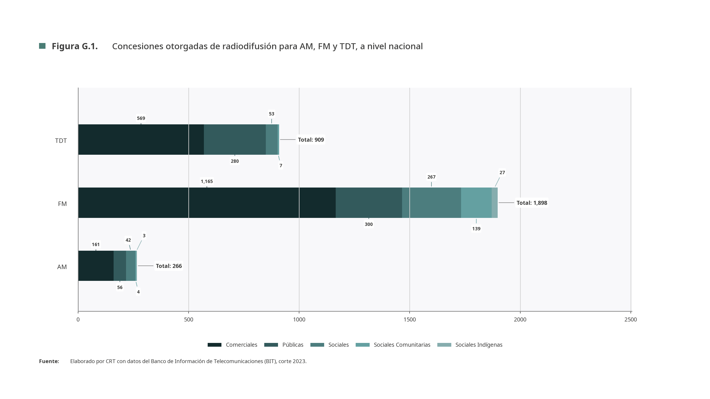
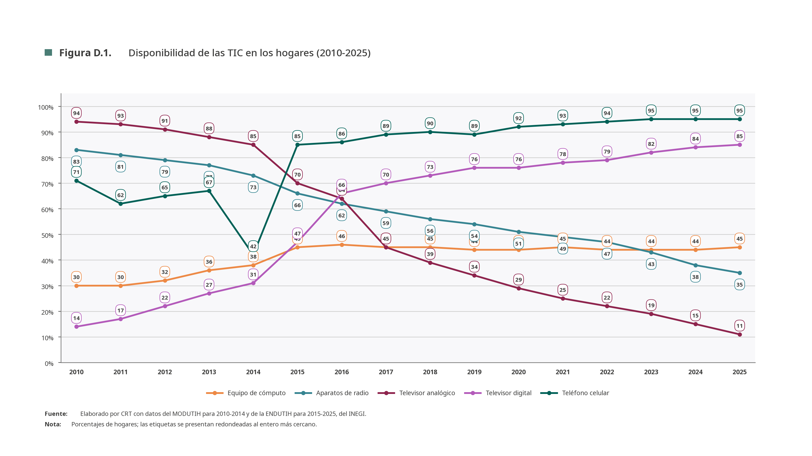
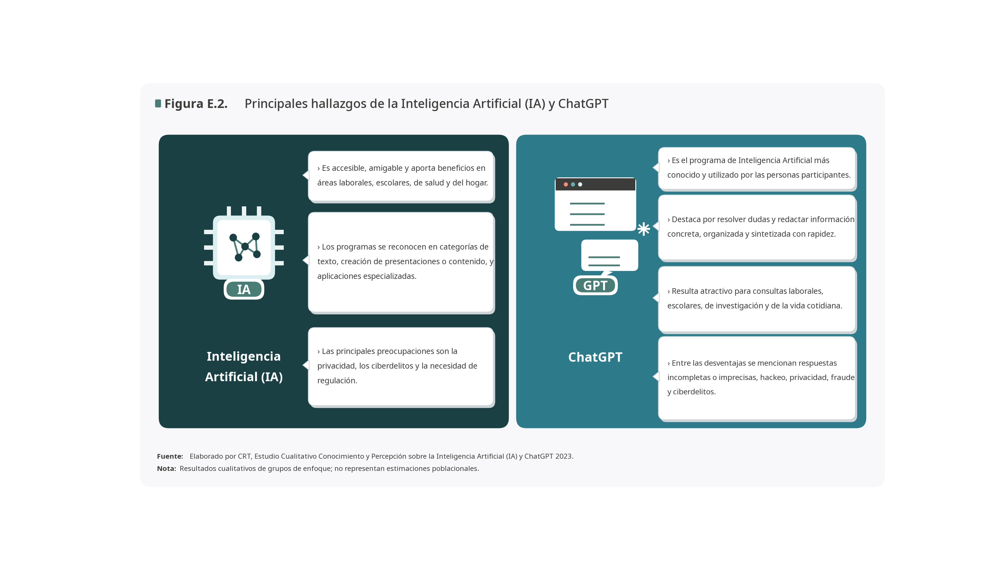

 

# Anuario Estadístico 2026

Proyecto reproducible que descarga o reutiliza datos oficiales, calcula cada
indicador, imprime los resultados, genera las gráficas y conserva evidencia de
cada corrida.

La entrega automatizada de las secciones **A a G está completa: 91 figuras**.
La sección H permanece en el inventario porque requiere bases de audiencias de
Nielsen IBOPE e INRA que no están disponibles en el proyecto.

## Ejecutar

```powershell
# Preparar el ambiente una sola vez
.\preparar_entorno.ps1

# Revisar el proyecto
.\ejecutar.ps1 doctor

# Ejecutar todas las figuras disponibles y crear el PowerPoint
.\ejecutar.ps1 run --assemble

# Ejecutar sólo una figura
.\ejecutar.ps1 run --only G.1

# Ejecutar un tramo
.\ejecutar.ps1 run --from A.1 --until G.1
```

Si Windows bloquea los archivos `.ps1`, se puede ejecutar directamente:

```powershell
.\.venv\Scripts\python.exe scripts\figures\figura_g_1.py
```

## Resultados

- Gráficas: `build/figures/<sección>/`
- Textos automáticos: `build/text/`
- PowerPoint: `entrega/`
- Datos usados, fuentes, cálculos y estado: `reportes/<corrida>/`
- Datos descargados y reutilizables: `data/raw/`

Cada figura tiene un solo script dentro de `scripts/figures/`. Si un archivo
crudo ya existe y está verificado, el programa lo reutiliza sin descargarlo de
nuevo. A.5 es la única figura con insumos manuales en `data/manual/A.5/`.

## Capturas

### Figura G.1 - Concesiones de radiodifusión



### Figura D.1 - Disponibilidad de TIC en los hogares



### Figura E.2 - Inteligencia Artificial y ChatGPT



## Evidencia para la defensa

En cada corrida se guardan automáticamente:

- referencia y fecha de cada fuente;
- huella y tamaño del archivo crudo;
- periodo detectado;
- tabla exacta usada por la gráfica;
- fórmula y resultado de cada cálculo;
- estado final de cada figura.

La metodología y la arquitectura permanecen disponibles en `docs/`.

## Licencia

El código nuevo usa licencia MIT. Los datos y publicaciones conservan los
términos de sus titulares.
