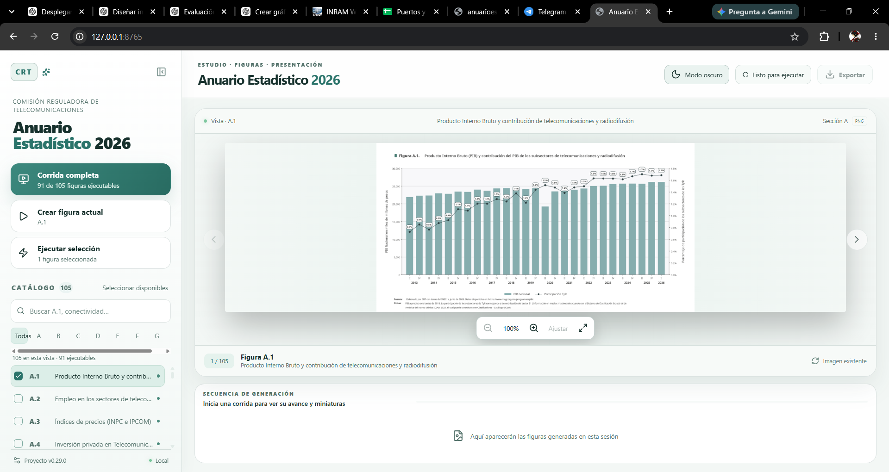
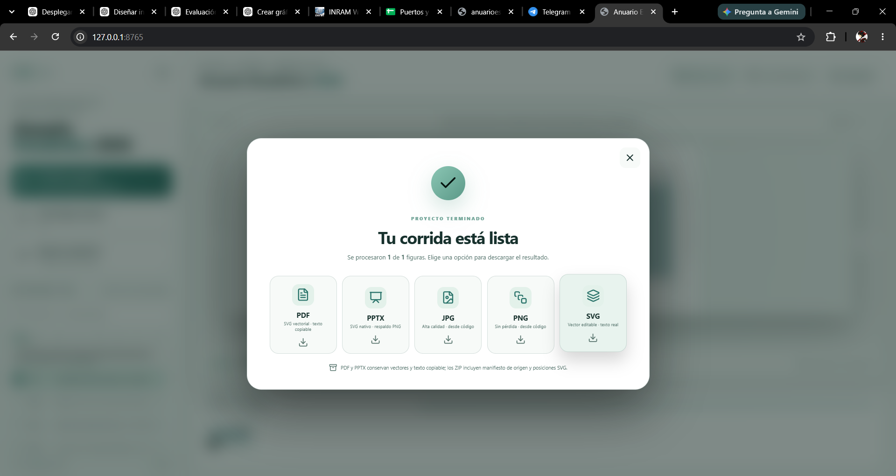

# Anuario Estadístico 2026

Aplicación local para **actualizar y generar las figuras del Anuario Estadístico
2026** a partir de datos verificables. El proyecto reúne la descarga o
reutilización de fuentes, el cálculo de indicadores, la creación de gráficas y el
registro de la evidencia de cada corrida. La interfaz web permite consultar el
catálogo, ejecutar figuras y descargar los resultados sin trabajar directamente
con los scripts.

Actualmente están automatizadas **91 figuras de las secciones A a G**. Las 14
figuras de audiencias de la sección H siguen pendientes de las bases licenciadas
de Nielsen IBOPE y de INRA.

## La interfaz web

La web se ejecuta en la computadora del usuario y se abre en
`http://127.0.0.1:8765`. Desde ella se puede:

- Buscar figuras en el catálogo y filtrar por sección.
- Ver una figura en grande, navegar entre resultados y ampliar la imagen.
- Crear la figura actual, ejecutar una selección o iniciar una corrida completa.
- Seguir el avance de la generación en tiempo real.
- Descargar la corrida en PDF, PPTX o compendios de imágenes JPG, PNG y SVG.
- Cambiar entre modo claro y oscuro.

### Vista principal

El panel izquierdo reúne el catálogo y las acciones de ejecución; el área central
muestra la figura seleccionada y el avance de la corrida.



### Descarga de resultados

Al terminar una corrida, la interfaz presenta las opciones de exportación. La
captura muestra una corrida de una figura; el mensaje de finalización se refiere
a esa corrida, no a todas las secciones del proyecto.



## Inicio rápido

Se requiere **Python 3.11 o superior**. La interfaz web también necesita
**Node.js 20 o superior**. Para exportar a PDF se requiere **Microsoft PowerPoint
o LibreOffice**.

En Windows, desde la raíz del repositorio:

```powershell
# Preparar el entorno y compilar la interfaz (sólo la primera vez)
.\preparar_entorno.ps1

# Revisar que el proyecto esté listo
.\ejecutar.ps1 doctor

# Abrir la interfaz web
.\ejecutar.ps1 web
```

Si se modifica el código de la interfaz, se recompila desde `web/` con
`npm run build`. La [guía del frontend](web/README.md) incluye el modo de desarrollo.

### Ejecución desde la terminal

La interfaz no es necesaria para ejecutar las figuras:

```powershell
# Generar todas las figuras disponibles y ensamblar el PowerPoint
.\ejecutar.ps1 run --assemble

# Generar una sola figura
.\ejecutar.ps1 run --only G.1

# Generar un tramo del catálogo
.\ejecutar.ps1 run --from A.1 --until G.1
```

En macOS o Linux se usan `./preparar_entorno.sh` y `./ejecutar.sh` con los mismos
subcomandos (`doctor`, `web` y `run`).

## Resultados y trazabilidad

| Resultado                                                 | Ubicación                                             |
| --------------------------------------------------------- | ------------------------------------------------------ |
| Figuras PNG, JPG y SVG                                    | `build/figures/<sección>/`                          |
| Textos generados                                          | `build/text/`                                        |
| PDF y presentación PowerPoint                            | `entrega/`                                           |
| Datos descargados y reutilizables                         | `data/raw/`                                          |
| Datos usados, fuentes, cálculos y estado de cada corrida | `reportes/<corrida>/`                                |
| Catálogo de fuentes por figura                           | `reportes/<corrida>/referencias_fuentes_figuras.csv` |

Cada figura disponible tiene un script en `scripts/figures/`. Si un archivo crudo
verificado ya existe, se reutiliza. La figura A.5 emplea insumos manuales en
`data/manual/A.5/`.

Los reportes de cada corrida conservan la referencia y fecha de la fuente, la
huella del archivo crudo, el periodo detectado, la tabla usada, las fórmulas y el
estado final de cada figura. Los ZIP de imágenes incluyen un manifiesto de
origen; el de SVG también registra sus textos y posiciones. Los SVG conservan
texto seleccionable. El PDF inserta los SVG originales como contenido vectorial,
y el PPTX mantiene las figuras editables y las narrativas como texto.

La [arquitectura](docs/ARQUITECTURA.md), las [metodologías](docs/) y las
[notas de la versión 0.30.0](PAQUETE_COMPLETO_0.30.0.md) documentan el diseño y
los detalles de exportación.

## Estado y trabajo futuro

| Alcance                               | Estado        | Fuente necesaria                              |
| ------------------------------------- | ------------- | --------------------------------------------- |
| Secciones A a G: 91 figuras           | Automatizadas | Fuentes registradas por figura en el proyecto |
| H.1 a H.10: audiencias de televisión | Pendientes    | Nielsen IBOPE / MSS TV                        |
| H.11 a H.14: audiencias de radio      | Pendientes    | Mediómetro Radio de INRA / INRAM             |

### Alcance de la edición completa

El [Anuario Estadístico 2024](assets/reference/anuario_2024_fuente/anuarioestadistico2024vf_0.pdf)
es la referencia de **estructura y contenido** para la edición 2026. Tiene 131
páginas. La plantilla actual de 2026 tiene 119 diapositivas, incluidas las 105
figuras previstas, separadores de sección y una conclusión. La diferencia de
páginas no equivale directamente a contenido faltante: primero hay que comparar
el índice y cada pieza editorial. El objetivo es replicar **sólo las secciones
que existen en 2024**, con información vigente para 2026; no añadir capítulos
nuevos para llenar espacio.

### Pendientes para cerrar el anuario

1. **Completar la estructura editorial.** Conciliar el índice de 2024 con la
   presentación 2026, página por página. Además de las figuras, la referencia
   contiene legales, glosario, introducción, puntos clave, herramientas, anexos
   I a IV y contraportada. Hoy la plantilla no incorpora todas esas piezas y sí
   incluye separadores y una conclusión que deben revisarse frente al documento
   de referencia. Ajustar el orden y la paginación final a las secciones que se
   conserven.
2. **Aplicar el diseño institucional.** Reproducir la composición editorial de
   portada, páginas interiores y contraportada: fondos, paleta, tipografía,
   logotipos, iconografía, encabezados, pies y numeración. Definir y validar la
   identidad visual oficial de la CRT para 2026 antes de sustituir los elementos
   del IFT presentes en la edición 2024. Revisar visualmente el PDF y el PPTX
   terminados contra la referencia.
3. **Completar y revisar la redacción.** Usar el texto de 2024 como base para las
   secciones sin redacción 2026. El registro actual ya conserva narrativas de
   2024 para las 91 figuras de A a G; faltan las de H y las piezas editoriales
   fuera de las figuras. Actualizar cifras, periodos, fuentes, enlaces y nombres
   institucionales donde corresponda. Los legales, puntos clave, tablas y
   anexos requieren revisión específica antes de publicarse; no basta con
   cambiar el año en el texto.
4. **Obtener los datos de audiencias.** Para H.11 a H.14, esperar la habilitación
   de Mediómetro Radio en INRAM o una exportación de INRA; el acceso identificado
   hasta ahora muestra TV/Video. Para H.1 a H.10, confirmar el acceso a Nielsen
   IBOPE / MSS TV o recibir su exportación. Revisar las bases y reproducir
   primero las cifras de julio de 2023 a junio de 2024; después calcular el
   periodo más reciente y desarrollar los scripts. Una gráfica o tabla
   redondeada no permite validar por sí sola los cálculos.
5. **Cerrar la revisión de publicación.** Comprobar que todas las secciones del
   índice estén presentes, que figuras, narrativas y anexos usen la misma versión
   de datos, que las fuentes y enlaces sean correctos y que no queden textos de
   relleno ni referencias institucionales desactualizadas. Verificar página por
   página el PDF y el PPTX exportados.

## Autor y licencia

**— Equipo de la DEI —**

**David Palestina** — david.palestina@crt.gob.mx

**Ivan Paredes** — ivan.paredes@crt.gob.mx

**Gustavo García** — [gustavo.garcia@crt.gob.mx](mailto:gustavo.garcia@crt.gob.mx).

El código nuevo usa la [licencia MIT](LICENSE). Los datos y publicaciones

conservan los términos de sus titulares.
